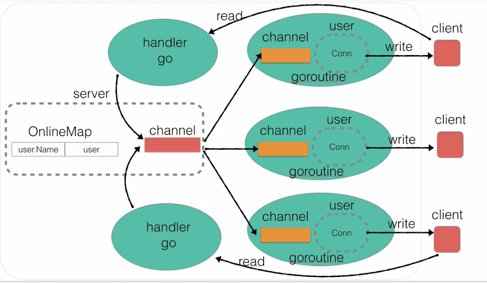

# chatroot-demo

聊天室 练习

[bilibili 视频教程](https://www.bilibili.com/video/BV1gf4y1r79E?p=37)

## todo

1. 整理需求
2. 拆分模块
3. 构建代码

### 1. server 整理需求

+ [x] 1. 启动并监听服务
+ [x] 2. 用户登陆 与 消息广播
+ [x] 3. 用户发送 并 广播消息
+ [x] 4. 整理业务代码， Server 和 User 的方法。
+ [x] 5. 使用 `who` 指令查询在线用户， 并发送给自己
+ [x] 6. 修改自己用户名, 命令格式 `rename|张三`
+ [x] 7. 用户超时强踢功能
+ [x] 8. 用户私聊

### 2. client 需求整理

+ [x] 1. 链接服务器
+ [x] 2. 使用 flag 绑定参数
+ [x] 3. 实现菜单功能 及 更新名字功能
+ [x] 4. 实现客户端消息接收功能
+ [x] 5. 实现公共聊天模式
+ [x] 6. 实现公共聊天室中的私聊功能 `/send>name message`